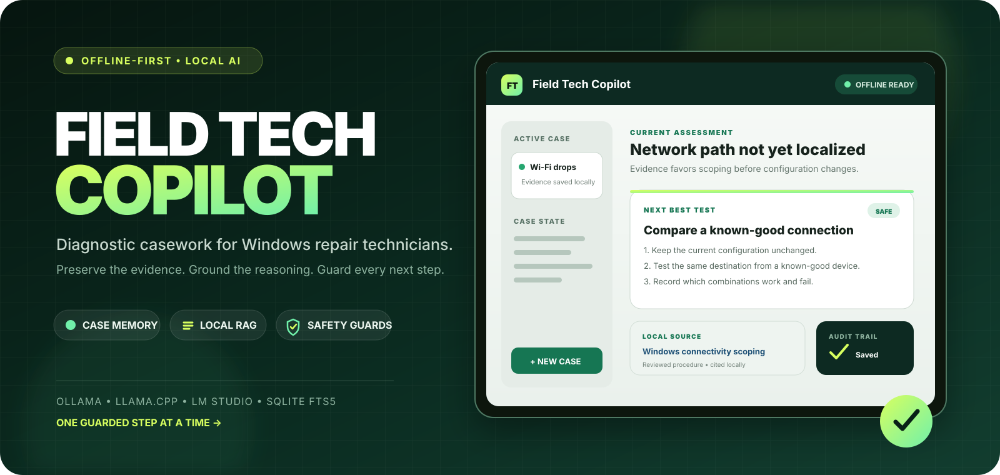
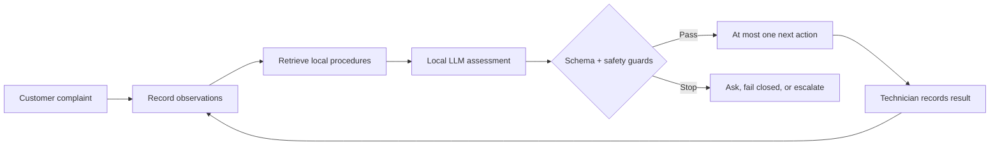
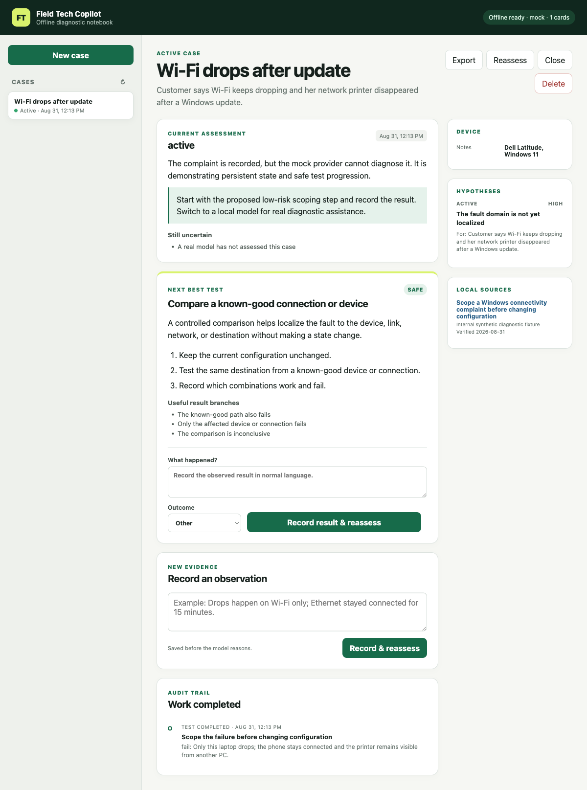

<p align="center">
  
</p>

<h1 align="center">Field Tech Copilot — Offline AI Diagnostics</h1>

<p align="center">
  <strong>Offline AI diagnostics for Windows repair technicians.</strong><br>
  A local-LLM workspace with persistent repair cases, grounded procedures, and deterministic safety guardrails—built for field work where internet access is unreliable.
</p>

<p align="center">
  <a href="https://ben4mn.github.io/field-tech-copilot/"></a>
  <a href="https://github.com/ben4mn/field-tech-copilot/releases"></a>
  <a href="https://github.com/ben4mn/field-tech-copilot/actions/workflows/ci.yml"></a>
  <a href="https://www.python.org/downloads/"></a>
</p>

<p align="center">
  <a href="https://ben4mn.github.io/field-tech-copilot/"><strong>Download</strong></a>
  · <a href="#run-from-source">Run the mock demo</a>
  · <a href="#safety-is-a-product-feature">Safety model</a>
  · <a href="docs/ARCHITECTURE.md">Architecture</a>
  · <a href="docs/EVALUATION.md">Evaluation</a>
</p>

> [!CAUTION]
> **Pre-alpha decision support—not an autonomous repair tool.** Field Tech Copilot does
> not execute commands, change customer systems, authorize repairs, or guarantee a
> diagnosis. A trained technician remains responsible for every test and intervention.

Field Tech Copilot is an **offline-first, local-AI diagnostic notebook for Windows
troubleshooting and field computer repair**. It preserves structured case state, ranks
hypotheses, retrieves relevant procedures from an on-device knowledge base, and returns
at most one guarded next test or intervention. It can also stop, ask for more evidence,
or recommend escalation when proceeding would be unsafe.

## Why field technicians use it

| In the field | What Field Tech Copilot does |
| --- | --- |
| Connectivity is unreliable | Runs the core workflow locally after models and software are downloaded. |
| Long chat threads lose context | Stores complaints, observations, completed work, hypotheses, and assessments in SQLite. |
| AI assistants repeat work | Blocks duplicate completions and rejects repeated tests without a material reason. |
| A confident answer can still be unsafe | Validates structured output, applies deterministic guards, and fails closed. |
| Generic advice ignores local procedure | Retrieves a bounded set of versioned offline cards and filters unsupported citations. |
| Customer data must stay controlled | Uses loopback-only defaults, has no cloud fallback or telemetry, and rejects recovery keys before storage. |

### The workflow



<p align="center">
  <a href="site/assets/app-preview.png">
    
  </a>
  <br>
  <sub>Synthetic case shown with the deterministic mock provider. Click for the full-size interface.</sub>
</p>

## Choose your local AI setup

| Profile | Best for | Runtime and model | Offline after setup? |
| --- | --- | --- | --- |
| **Field Kit Lite** | Packaged Windows evaluation | Bundled llama.cpp CPU runtime + Qwen3-1.7B Q8_0 | Yes, for setup and the core case workflow |
| **Full local AI** | Comparing diagnostic quality on your hardware | Ollama with Qwen3 8B as the control, or an OpenAI-compatible llama.cpp / LM Studio endpoint | Yes, after downloading the model |
| **Mock demo** | UI, persistence, API, and contributor work | Deterministic mock provider; no model download | Yes |

The tested Qwen3-30B-A3B Q4_K_M configuration is a promising quality candidate on a
64 GB dual-channel Dell Latitude 5550, not a field-readiness claim. It is not bundled.
See the [reproducible benchmark](docs/benchmarks/2026-09-03-qwen3-30b-a3b-latitude-5550.md)
before choosing a model or buying hardware.

## Download for Windows

The [Field Kit download site](https://ben4mn.github.io/field-tech-copilot/) provides a
single Windows x64 installer containing:

- the Field Tech Copilot application and Python runtime;
- a pinned llama.cpp CPU runtime and official Qwen3-1.7B Q8_0 GGUF;
- the reviewed 16-card Windows field procedure pack plus a synthetic starter card;
- app-local Visual C++ runtime files and third-party licenses; and
- a SHA-256 checksum and machine-readable bundle manifest.

**Requirements:** Windows 10 22H2 or Windows 11, x64 CPU, 8 GB RAM, and 6 GB free
disk space.

1. Download the installer and adjacent `.sha256` file from the
   [current preview](https://github.com/ben4mn/field-tech-copilot/releases).
2. Compare the checksum before installation:

   ```powershell
   $installer = Get-ChildItem .\FieldTechCopilot-*-Setup.exe | Select-Object -First 1
   Get-FileHash -Algorithm SHA256 $installer.FullName
   Get-Content "$($installer.FullName).sha256"
   ```

3. Install and launch. Cases and logs are kept outside the program directory at
   `%LOCALAPPDATA%\FieldTechCopilot` so an uninstall or upgrade does not silently erase
   case data.

> [!WARNING]
> Preview installers are unsigned unless the release shows a trusted Authenticode
> publisher. Windows SmartScreen or organization policy may block them. Do not bypass
> your security policy.

The bundled 1.7B model proves the offline packaging and workflow; it has **not** been
validated for field diagnosis. Read the [Windows distribution and clean-machine
checklist](docs/WINDOWS_DISTRIBUTION.md) before a pilot.

## Run from source

Prerequisites: [Python 3.11+](https://www.python.org/),
[uv](https://docs.astral.sh/uv/), and Git.

### Mock demo—no local model required

```powershell
git clone https://github.com/ben4mn/field-tech-copilot.git
Set-Location field-tech-copilot
uv sync --extra dev --locked
uv run fieldtech knowledge ingest .\knowledge\josh-and-sons-fieldtech-knowledge-v1
uv run fieldtech serve --provider mock
```

Open <http://127.0.0.1:8765>. The mock provider exercises case management and safety
flow but does not provide diagnostic reasoning.

### Ollama + Qwen3 8B

Download the model while connected:

```powershell
ollama pull qwen3:8b
ollama serve
```

Then, in another terminal:

```powershell
$env:FIELDTECH_MODEL_PROVIDER = "ollama"
$env:FIELDTECH_MODEL_BASE_URL = "http://127.0.0.1:11434"
$env:FIELDTECH_MODEL_NAME = "qwen3:8b"
uv run fieldtech knowledge ingest .\knowledge\josh-and-sons-fieldtech-knowledge-v1
uv run fieldtech doctor
uv run fieldtech serve
```

Configuration uses `FIELDTECH_*` environment variables; see
[`.env.example`](.env.example). The application does not load `.env` automatically.
Use your shell, a launcher, or `uv run --env-file .env ...` when you want file-based
configuration.

## Safety is a product feature

Local inference alone does not make an AI repair assistant safe. Field Tech Copilot
keeps model suggestions behind application-owned controls:

- **Human control:** no shell, PowerShell, repair, or recovery command is executed.
- **One action at a time:** each accepted assessment contains at most one test or one
  intervention; the model can instead request information or escalate.
- **Stale-action protection:** new evidence, timeouts, and rejected output immediately
  invalidate old actions.
- **Risk controls:** non-safe interventions require prerequisites, rollback, and explicit
  technician confirmation.
- **BitLocker privacy:** unlock or data access is a `caution` intervention requiring
  authorization and a matching key ID; recovery keys are rejected before storage,
  prompts, results, or exports.
- **Data-recovery protection:** an unstable or disappearing original drive cannot be used
  for file-level copying; the workflow routes toward an image, verified duplicate, or
  professional recovery.
- **Fail-closed model boundary:** schema errors, provider failures, unsupported
  citations, and unsafe proposals are not partially accepted.

Read the [knowledge and safety policy](docs/KNOWLEDGE_AND_SAFETY.md) and
[security model](SECURITY.md) for the exact boundaries.

## Offline knowledge coverage

The reviewed starter pack contains 16 conservative, source-linked procedure cards:

- **Windows networking:** APIPA, DHCP, DNS scoping, and controlled DNS repair;
- **Storage and data recovery:** read-only health triage, external drives, unstable-media
  stop conditions, image-first recovery, copy verification, and authorized BitLocker;
- **Windows and hardware:** startup recovery, DISM/SFC, Defender triage, Dell startup
  symptoms, blank screens, battery reports, and thermal/fan scoping; and
- **Printing:** connection, queue, and application isolation.

Cards use stable IDs, applicability rules, primary sources, verification dates, risk
levels, prerequisites, rollback instructions, and explicit stop conditions. Teams can
author and index their own Markdown cards without changing application code.

```powershell
uv run fieldtech knowledge ingest .\path\to\knowledge
```

## Architecture

```text
Local browser UI
      │
FastAPI on 127.0.0.1
      │
Diagnostic service ────────── deterministic safety and repeat guards
   │              │                         │
SQLite         SQLite FTS5             local model provider
cases + audit  procedure cards         Ollama / llama.cpp / mock
```

- `src/fieldtech/api/` — local HTTP API and zero-build browser UI
- `src/fieldtech/core/` — case models, persistence, orchestration, privacy, and guards
- `src/fieldtech/knowledge/` — Markdown card parsing and SQLite FTS5 retrieval
- `src/fieldtech/providers/` — mock, Ollama, and OpenAI-compatible llama.cpp adapters
- `knowledge/` — reviewed field procedure pack
- `tests/` — deterministic unit, API, safety, and adversarial tests
- `packaging/` — reproducible Windows bundle and installer definitions
- `site/` — static download site and release-manifest client

For the deeper design, read the [architecture](docs/ARCHITECTURE.md),
[product brief](docs/PRODUCT_BRIEF.md), and [implementation plan](docs/IMPLEMENTATION_PLAN.md).

## Test and evaluate

```powershell
uv run ruff check .
uv run pytest --cov=fieldtech --cov-report=term-missing
```

Real-model promotion is benchmark-driven. The repository includes a strict seven-case
runner covering APIPA/DHCP, DNS-only failure, BitLocker, an unstable drive, a printer,
a blank display, and battery shutdown. Strict mode refuses accidental mock runs; it
requires and records the operator-supplied runtime version and model-file SHA-256 along
with timing, citations, retries, and guard outcomes.

- [Evaluation protocol](docs/EVALUATION.md)
- [Model and runtime strategy](docs/MODEL_AND_RUNTIME.md)
- [Latitude 5550 / Qwen3-30B-A3B field benchmark](docs/benchmarks/2026-09-03-qwen3-30b-a3b-latitude-5550.md)
- [Windows release verification](docs/WINDOWS_DISTRIBUTION.md)

## Privacy and repository hygiene

Cases remain local by default, but repair records and Markdown exports can still contain
sensitive customer information. Use OS full-disk encryption and your organization’s
retention policy. Never commit customer data, real repair transcripts, databases, logs,
model weights, embeddings, `.env` files, credentials, recovery keys, or licensed vendor
manuals. Use synthetic or fully anonymized examples only.

## FAQ

<details>
<summary><strong>Does Field Tech Copilot work completely offline?</strong></summary>

Yes for the core case workflow after installation and model download. Field Kit Lite
bundles its local model and runtime; the Ollama and LM Studio-compatible paths require
you to download a model before disconnecting. Run `fieldtech doctor`, restart, disable
network interfaces, and complete a saved-case smoke test before relying on an offline
setup.
</details>

<details>
<summary><strong>Is this an AI computer repair bot?</strong></summary>

It is a diagnostic decision-support notebook, not an autonomous repair bot. It organizes
evidence and proposes at most one guarded next action. It never executes the action.
</details>

<details>
<summary><strong>Which local LLM runtimes are supported?</strong></summary>

The application supports Ollama, a bundled or separately hosted llama.cpp
OpenAI-compatible endpoint, and a deterministic mock provider. The same compatible
adapter is used for LM Studio benchmarking.
</details>

<details>
<summary><strong>Can it help with BitLocker or data recovery?</strong></summary>

It includes conservative workflows for authorized BitLocker access, unstable media,
image-first recovery, and copy verification. It does not crack encryption, retain a
recovery key, or authorize access to customer data.
</details>

<details>
<summary><strong>Does it support macOS or Linux?</strong></summary>

The packaged field kit currently targets Windows 10/11 x64. The Python source and tests
can run on other platforms, but no macOS or Linux desktop bundle is promised yet.
</details>

## Contributing and feedback

Issues and focused pull requests are welcome for reproducible bugs, guarded workflow
improvements, provider integrations, synthetic evaluation cases, and redistribution-safe
knowledge cards. Keep reports free of customer data and secrets. Report security issues
privately as described in [SECURITY.md](SECURITY.md).

This project is source-available under the [Field Tech Copilot Source-Available License
1.0](LICENSE). Personal use, internal evaluation, field-support work, and internal
modification are permitted; selling, sublicensing, publishing, or redistribution requires
prior written permission. Bundled components retain their own terms—see
[third-party notices](THIRD_PARTY_NOTICES.md).

<p align="center">
  <strong>Building safer local AI for real repair work?</strong><br>
  Star the repository, try the mock workflow, and share a synthetic field case.
</p>
